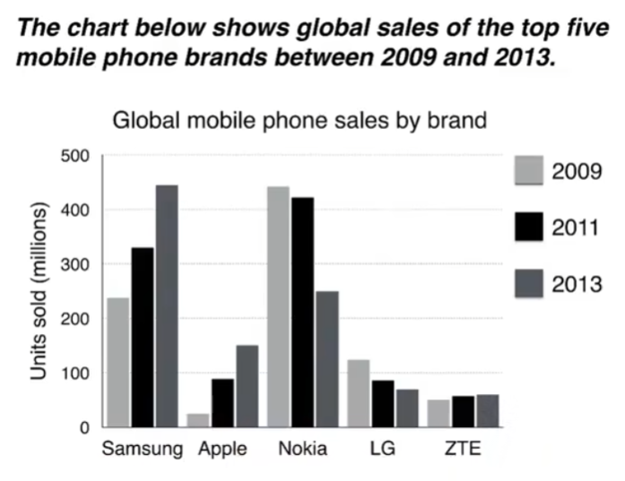

# 柱状图

The bar chart compares the number of mobile phones sold worldwide by the five most popular manufacturers in the years 2009, 2011 and 2013.
It is clear that Nokia sold the most mobile phones between 2009 and 2011, but Samsung became the best selling brand in 2013. Samsung and Apple saw the biggest rises in sales over the 5-year period.
In 2009, Nokia sold close to 450 million mobile phones, which was almost double the number of handsets sold by the second most successful manufacturer, Samsung. Over the following 4 years, however, Nokia's sales figures fell by approximately 200 million units, whereas Samsung saw sales rise by a similar amount. By 2013, Samsung had become the market leader with sales reaching 450 million units.
The other three top selling mobile phone brands between 2009 and 2013 were LG, ZTE and Apple. In 2009, these companies sold around 125 million, 50 million and 25 million mobile handsets respectively, but Apple overtook the other two vendors in 2011. In 2013, purchases of Apple handsets reached 150 million units, while LG saw declining sales and the figures for ZTE rose only slightly.

## 重点词汇

| 英文短语                                      | 中文翻译                     |
| --------------------------------------------- | ---------------------------- |
| sold worldwide                                | 全球销量                     |
| sales figures, purchases                      | 销售数据，购买量             |
| most popular, best selling brand, top selling | 最受欢迎/最畅销品牌/销量最高 |
| second most successful manufacturer           | 第二成功的制造商             |
| market leader                                 | 市场领导者                   |
| mobiles phones, handsets, units               | 手机/手持设备/单位           |
| brands, manufacturers, companies, vendors     | 品牌/制造商/公司/供应商      |
| saw the biggest rises, saw declining sales    | 涨幅最大/销量下降            |
| close to, almost, approximately, around       | 接近/几乎/大约/左右          |
| double the number                             | 数量翻倍                     |
| rise by a similar amount                      | 涨幅相似                     |
| respectively                                  | 分别                         |
| overtook the other two vendors                | 超过其他两家供应商           |
