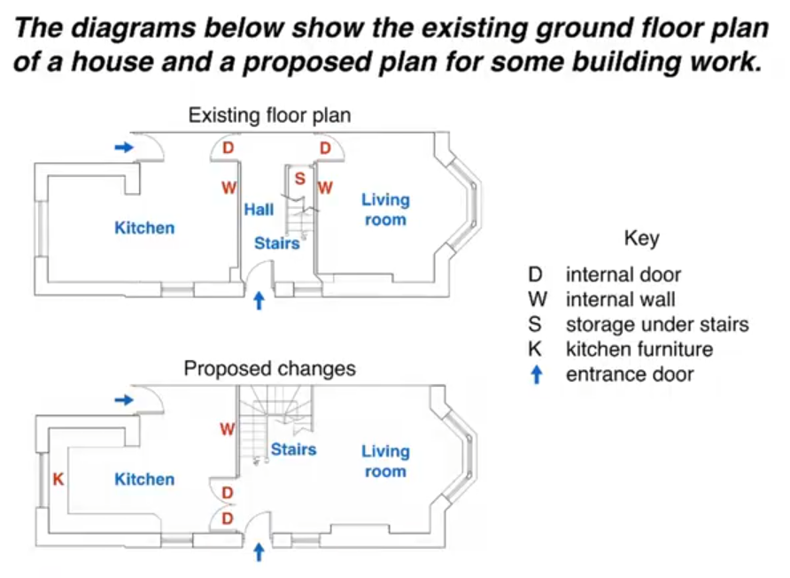

# 比较图表

## 范文

The two pictures compare the current layout of the ground floor of a house with a plan to redesign the same living space.

<!-- 一个变化，一个没有变化 -->

We can see that the design proposal involves making a number of changes to the ground floor of the house, mainly in the central hall area. There are no plans to change external walls or entrances.

<!-- 选取一半作比较 -->

The most noticeable change from the existing to the proposed floor plan is that there will no longer be a separate hall area when the building work has been done. This will be achieved by removing the internal wall and door between the hall and living room, along with the current staircase and under-stair storage cupboard. With no separate hall area, the proposed living room will also contain the staircase to the first floor.

To replace the current straight staircase, a new set of winding stairs will be installed in the corner of the living room. The internal door between the hall and kitchen will also be replaced with double doors connecting the kitchen with the new living room. Finally, the planned building work will also includethe installation of some kitchen furniture.

## 重点词汇

| 英文短语                                   | 中文翻译                   |
| ------------------------------------------ | -------------------------- |
| existing plan → current layout             | 现有方案 → 当前布局        |
| proposed plan → plan to redesign           | 提议方案 → 重新设计计划    |
| design proposal, planned building work     | 设计方案，计划中的建筑工程 |
| there will no longer be                    | 将不再有...                |
| this will be achieved by removing          | 将通过移除...来实现        |
| will also contain, will also include       | 还将包含/还将包括          |
| will be installed, will be replaced        | 将被安装/将被替换          |
| the design proposal involves               | 设计方案涉及...            |
| when the building work has been done       | 当建筑工程完成后           |
| living space, central hall area, staircase | 生活区/中央大厅区域/楼梯   |
| under-stair storage cupboard               | 楼梯下储物柜               |
| a new set of winding stairs                | 一组新的旋转楼梯           |
| the installation of some kitchen furniture | 安装一些厨房家具           |

[返回目录](../README.md)
