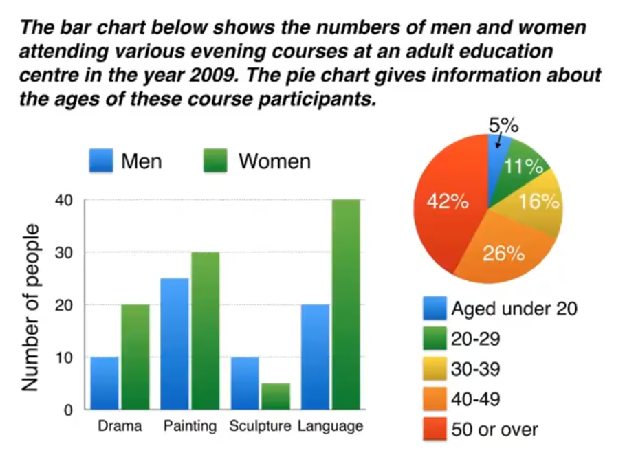

# 不同图表

The bar chart compares the numbers of males and females who took four different evening classes in 2009, and the pie chart shows the age profile of these attendees.

It is clear that significantly more women than men attended evening classes at the education centre. We can also see that evening courses were much more popular among older adults.

According to the bar chart, drama, painting and language courses all attracted more women than men to the education centre in 2009. Language classes had the highest number of participants overall, with 40 female and 20 male students, while painting was a popular choice among both genders, attracting 30 female and 25 male attendees. The only course with a higher number of males was sculpture, but this course was taken by a mere 15 people in total.

Looking at the age profile pie chart, we can see that the majority of people attending evening lessons were over 40 years of age. To be precise, 42% of them were aged 50 or more, and 26% were aged between 40 and 49. Younger adults were in the minority, with only 11% of students aged 20 to29, and only 5% aged under 20.

## 重点词汇

| 英文短语                                | 中文翻译            |
| --------------------------------------- | ------------------- |
| attending courses, who took classes     | 参加课程/上课的人   |
| participants, attendees, students       | 参与者/参加者/学生  |
| males and females                       | 男性和女性          |
| courses attracted more women            | 课程吸引了更多女性  |
| a popular choice among both genders     | 两性中的热门选择    |
| significantly more, higher, highest     | 明显更多/更高/最高  |
| had the highest number, with (+ number) | 数量最多，有(+数字) |
| was taken by a mere 15 people           | 仅有 15 人参加      |
| According to the bar chart,             | 根据柱状图显示，    |
| Looking at the age profile pie chart,   | 观察年龄分布饼图，  |
| the majority of people                  | 大多数人            |
| were in the minority                    | 属于少数            |
| To be precise,                          | 准确地说，          |
