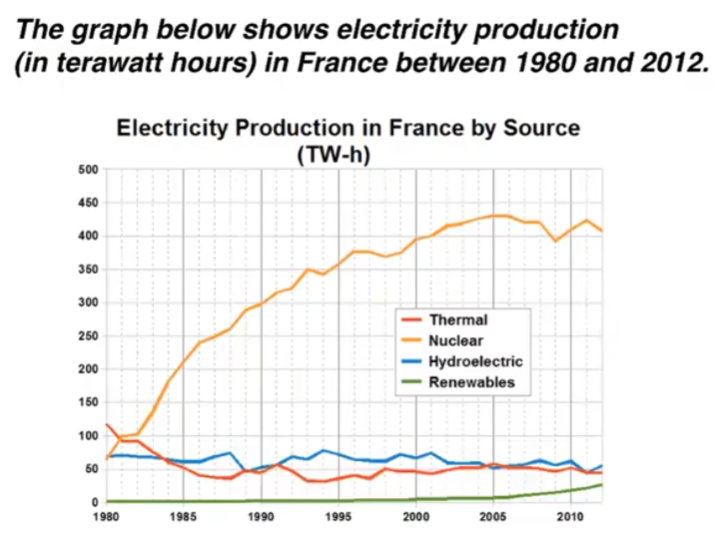

# 折线图

The line graph compares the amount of electricity production in France using four different sources of power over a period of 32 years.

It is clear that nuclear power was by far the most important means of electricity generation over the period shown. Renewables provided the lowest amount of electricity in each year.

In 1980, thermal power stations were the main source of electricity in France, generating around 120 terawatt hours of power. Nuclear and Hydroelectric power stations produced just under 75 terawatt hours of electricity each. And Renewables provided a negligible amount. Just one year later, Nuclear overtook Thermal power as the primary source of electricity.

Between 1980 and 2005, electricity production from nuclear power rose dramatically to a peak of 430 terawatt hours. By contrast, the Thermal power fell to only 50 terawatt hours in 1985, and remained at this level for the rest of the period. Hydroelectric power generation remained relatively stable, at between 50 and 80 terawatt hours, for the whole 32 year period. But Renewables electricity production saw only a small rise to approximately 25 terawatt hours in 2012.

## 重点词汇

| 英文短语                                 | 中文翻译                 |
| ---------------------------------------- | ------------------------ |
| amount of electricity produced           | 发电量                   |
| source of/provided/generating            | 来源/提供/发电           |
| means of electricity generation          | 发电方式                 |
| over a period of / over the period shown | 在一段时间内/在所示期间  |
| by far the most important                | 迄今为止最重要的         |
| a negligible amount                      | 可忽略的量               |
| nuclear power overtook thermal power     | 核电超过火电             |
| as the primary source of electricity     | 作为主要的电力来源       |
| rose dramatically to a peak of           | 急剧上升至峰值           |
| by contrast                              | 相比之下                 |
| the figure for                           | ...的数据                |
| remained at this level, remained stable  | 保持在这一水平，保持稳定 |
| saw only a small rise                    | 仅小幅上升               |
