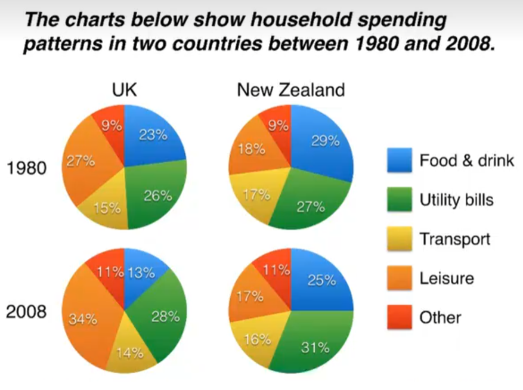

# 饼状图

The pie charts compare five categories of household expenditure in the UK and New Zealand in the years 1980 and 2008.

It is noticeable that the proportion of spending on food and drink fell in both countries over the 28-year period, while spending on utility bills rose. Also, UK residents spent a significantly larger percentage of their household budgets on leisure than their New Zealand counterparts.

In 1980, 29% of an average New Zealand household budget went on food and drink, while the equivalent figure for a UK home was 23%. By 2008, expenditure on food and drink had fallen by 4% in New Zealand, and by a full 10% in the UK. By contrast, both countries saw an increase in expenditure on utility bills for the average home, from 27% to 31% in New Zealand and from 26% to 28% in the UK.

Leisure activities accounted for the highest proportion of UK household spending in both years, but only the third highest proportion in New Zealand. In fact, in 2008, New Zealanders spent only half as much in relative terms on recreation (17%) as UK residents (34%). In both countries, transport costs and other costs took roughly 15% and 10% of household budgets respectively.

## 重点词汇

| 英文短语                                               | 中文翻译                  |
| ------------------------------------------------------ | ------------------------- |
| spending, expenditure, spent, costs                    | 支出/花费/开销/成本       |
| proportion of spending                                 | 支出比例                  |
| percentage of household budget                         | 家庭预算的百分比          |
| the equivalent figure for a UK home                    | 英国家庭的同等数据        |
| fell, rose, saw an increase in                         | 下降/上升/出现增长        |
| by 2008, expenditure had fallen                        | 到 2008 年，支出已下降    |
| spent a significantly larger percentage                | 支出比例明显更高          |
| than their New Zealand counterparts                    | 相比新西兰的对应家庭      |
| 29% of an average household budget went on             | 平均家庭预算的 29%用于... |
| while, by contrast                                     | 然而相比之下              |
| leisure accounted for the highest proportion           | 休闲娱乐占比最高          |
| ... spent half as much in relative terms on ... as ... | 相对支出仅为一半          |
| recreation                                             | 娱乐活动                  |

[返回目录](../README.md)
