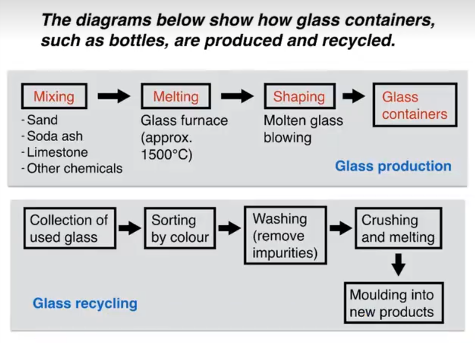

# 流程图

## 范文

The first flow diagram illustrates the process of glass container production, and the second diagram shows steps in the process of recycling used glass.

We can see that glass is made using three main raw materials, and that the manufacturing process consists of four distinct stages. lt requires five steps to turn used glass into new glass products.

At the first stage in the production of glass, sand, soda ash, limestone and other chemicals are mixed together. Next, this mixture is heated in a glass furnace at approximately 1500°C to produce molten glass. The molten glass can then be shaped, by blowing, to create the end products,namely glass containers.

Glass recycling begins with the collection of used glass products. The collected glass is sorted according to its colour, and then washed in order to remove any impurities. At the fourth stage of recycling, the glass is crushed and melted, and the resulting molten glass can finally be moulded to create new items.

## 重点词汇

| 英文短语                                    | 中文翻译                |
| ------------------------------------------- | ----------------------- |
| steps / stages in the process of            | ...过程中的步骤/阶段    |
| consists of four distinct stages            | 包含四个不同阶段        |
| it requires five steps                      | 需要五个步骤            |
| raw materials, end products                 | 原材料，最终产品        |
| production, manufacturing                   | 生产，制造              |
| turn used glass into new products           | 将废旧玻璃转化为新产品  |
| at the first stage, next, then, begins with | 第一阶段/接着/然后/始于 |
| are mixed, is heated, can be shaped         | 被混合/被加热/可塑形    |
| is sorted according to                      | 根据...进行分类         |
| can be moulded to create                    | 可塑形制成...           |
| are mixed → this mixture                    | 被混合 → 这种混合物     |
| collection → the collected glass            | 收集 → 收集到的玻璃     |
| is melted → the resulting molten glass      | 被熔化 → 得到的熔融玻璃 |
