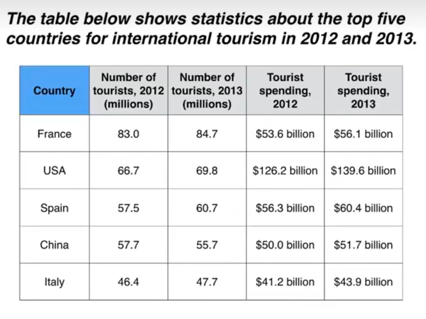

# 表格

The table compares the five highest ranking countries in terms of the numbers of visits and the money spent by tourists over a period of 2 years.

It is cleat that France was the world's most popular tourist destination in the years 2012 and 2013. However, the USA earned by far the most revenue from tourism over the same period.

In 2012, 83 million tourists visited France, and theUSA was the second most visited country, with 66.7 million tourists. Spain and China each received just under 58 million visitors, while Italy was ranked fifth with 46.4 million tourists. 2013 saw a rise of between 1 and 4 million tourist visits to each country, with the exception of China, which received 2 million fewer visitors than in the previous year.

Spending by tourists visiting the USA increased from $126.2 billion in 2012 to $139.6 billion in 2013, and these figures were well over twice as high as those for any other country. Spain received the second highest amounts of tourist revenue, rising from $56.3 billion to $60.4 billion, followed by France, China and Italy. Interestingly, despite falling numbers of tourists, Chinese revenue from tourism rose by $1.7 billion in 2013.

## 重点词汇

| 英文短语                                      | 中文翻译                          |
| --------------------------------------------- | --------------------------------- |
| five highest ranking countries                | 排名前五的国家                    |
| the world’s most popular tourist destination  | 全球最受欢迎的旅游目的地          |
| earned by far the most                        | 收入远超其他                      |
| revenue from tourism                          | 旅游收入                          |
| the second most visited country               | 第二大旅游访问国                  |
| received... visitors                          | 接待...游客                       |
| ranked fifth                                  | 排名第五                          |
| 2013 saw a rise of                            | 2013 年出现了...增长              |
| fewer visitors than in the previous year      | 游客数量少于前一年                |
| these figures were well over twice as high as | 这些数字是...的两倍多             |
| amounts of tourist revenue                    | 旅游收入金额                      |
| despite falling numbers                       | 尽管数量下降                      |
| saw a rise, increased, rising from, rose by   | 出现增长/增加/从...上升/增长了... |
