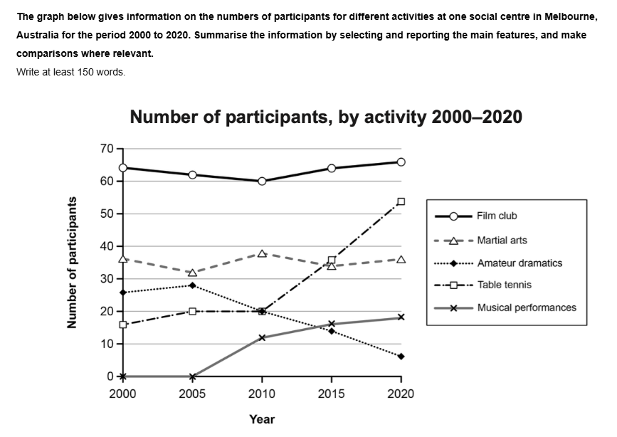

## 题目

The line-graph compares the amount of participants at one social centre in Melbourne , Australia joining 5 different activities over a period of 20 years.

It is clear that the Film club consistently attracted the largest audiences throughout the period . Table tennis and Amateur dramatics showed contrasting trends, with the former rising dramatically and the latter experiencing a decline.

In 2000 Film had the highest participation at around 65 people, followed by Martial arts (37) and Amateur dramatics (26). Table tennis and Musical performance ranked the fourth and fifth respectively, with 18 and 0 participants. By 2015, table tennis had overtaken martial arts to become the second most popular activity, rising by 20 participants to reach around 36.

The most significant change occurred between 2010 and 2020. Film club saw a steady increase to 75 participants in 2020, while table tennis surged to 52, doubling its 2000 figure. Martial arts remained stable at around 35 participants. Interestingly, Amateur dramatics dropped to only 6 participants by 2020, whereas Musical performance saw a small rise to 20 participants over the period between 2005 and 2020.
